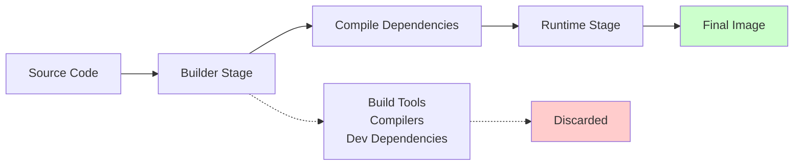

Large Language Model (LLM) applications are transforming industries with capabilities like natural language understanding, document summarization, and intelligent chatbots.

But deploying these applications efficiently is not trivial.

They rely on heavy dependencies (e.g., PyTorch, HuggingFace Transformers, LangChain), often require GPU support, and must run consistently across development, staging, and production.

One of the most effective techniques to achieve fast, secure, and cost-efficient deployments is **multi-stage Dockerization**.

This article explains why multi-stage builds are critical for LLM application development and how they improve performance, security, and maintainability.

## What Is Multi-Stage Dockerization?

A multi-stage Docker build is a way to create a Docker image using multiple stages within a single `Dockerfile`{: .filepath}.

Instead of installing all dependencies directly in a single image, you separate the build process into stages:

- **Builder Stage** – Installs heavy build tools and compiles packages
- **Runtime Stage** – Copies only the essential runtime artifacts (application code, pre-built libraries, and models)

This separation allows you to produce a smaller, cleaner, and more secure final image.



## Why Multi-Stage Builds Matter for LLM Applications

LLM applications are unique. They deal with large models, complex dependencies, and performance-critical workloads. Here's why multi-stage Dockerization is a game-changer:

### Smaller Image Size → Faster Deployment

LLM apps often require:

- Large Python libraries (`torch`{: .filepath}, `transformers`{: .filepath}, `langchain`{: .filepath})
- GPU drivers (CUDA, cuDNN)
- Build tools (`gcc`{: .filepath}, `make`{: .filepath}, `cmake`{: .filepath})

A single-stage Dockerfile would include both build tools and runtime libraries, inflating the image to 4–6 GB or more.

With a multi-stage build:

- The builder compiles dependencies
- The runtime stage copies only the pre-compiled packages

> **Result:** Final images are often under 1 GB, leading to faster image uploads to AWS ECR, Azure Container Registry, or Docker Hub, quicker startup times in Kubernetes, ECS, or Azure Container Apps, and reduced storage costs.
{: .prompt-tip }

### Faster Builds & CI/CD Pipelines

Multi-stage Docker caching speeds up development:

- Dependencies (which rarely change) remain cached in the builder stage
- Only your application code rebuilds when updated

This drastically reduces build times, allowing teams to iterate and deploy model updates quickly.

### Enhanced Security

A smaller image isn't just faster—it's safer.

By discarding the builder stage:

- Compilers, debugging tools, and unnecessary packages never reach production
- The runtime image contains only what the application needs

> This minimizes the attack surface and reduces the risk of vulnerabilities (CVEs), which is especially important when handling sensitive data in enterprise LLM systems.
{: .prompt-warning }

### Hardware Flexibility (CPU/GPU Builds)

LLM applications may run on:

- GPU environments for high-performance inference
- CPU-only environments for cost-effective scaling

With multi-stage builds, you can create conditional stages or targets:

```bash
docker build --target gpu -t my-llm-app:gpu .
docker build --target cpu -t my-llm-app:cpu .
```
{: .nolineno }

This ensures the same codebase produces optimized images for different hardware setups.

### Preloaded Models for Faster Startup

LLM deployments often need pre-downloaded models (e.g., HuggingFace weights, embeddings).

With a builder stage, you can:

- Download and cache models during the build process
- Ship the final image with ready-to-use models

> **Benefit:** Avoids cold starts and slow downloads during runtime.
{: .prompt-info }

### Consistency & Reproducibility

Multi-stage builds ensure that the same environment is used across development, testing, and production.

No more "it works on my machine" issues—your model and its dependencies behave identically everywhere.

## Example: Multi-Stage Dockerfile for an LLM API

Below is a simplified `Dockerfile`{: .filepath} for a FastAPI-based LLM application (e.g., RAG chatbot with LangChain and Chroma):

```dockerfile
# ---- Stage 1: Builder ----
FROM python:3.12-slim AS builder

# Install system dependencies and build tools
RUN apt-get update && apt-get install -y \
    build-essential \
    gcc \
    g++ \
    cmake \
    && rm -rf /var/lib/apt/lists/*

# Set working directory
WORKDIR /app

# Copy requirements and install Python dependencies
COPY requirements.txt .
RUN pip install --no-cache-dir --user -r requirements.txt

# Optional: Download and cache models
RUN python -c "from transformers import AutoTokenizer, AutoModel; \
    AutoTokenizer.from_pretrained('sentence-transformers/all-MiniLM-L6-v2'); \
    AutoModel.from_pretrained('sentence-transformers/all-MiniLM-L6-v2')"

# ---- Stage 2: Runtime ----
FROM python:3.12-slim AS runtime

# Install only runtime dependencies
RUN apt-get update && apt-get install -y \
    curl \
    && rm -rf /var/lib/apt/lists/*

# Create non-root user for security
RUN useradd --create-home --shell /bin/bash app

# Set working directory
WORKDIR /app

# Copy Python packages from builder stage
COPY --from=builder /root/.local /home/app/.local

# Copy application code
COPY --chown=app:app . .

# Switch to non-root user
USER app

# Make sure scripts in .local are usable
ENV PATH=/home/app/.local/bin:$PATH

# Expose port
EXPOSE 8080

# Health check
HEALTHCHECK --interval=30s --timeout=10s --start-period=5s --retries=3 \
    CMD curl -f http://localhost:8080/health || exit 1

# Start application
CMD ["uvicorn", "main:app", "--host", "0.0.0.0", "--port", "8080"]
```
{: file="Dockerfile" }

**Key Features:**
- **Builder Stage:** Installs heavy dependencies and build tools
- **Runtime Stage:** Contains only the lightweight application and precompiled libraries
- **Security:** Uses non-root user and minimal base image
- **Health Check:** Ensures container health monitoring
- **Model Caching:** Pre-downloads models to avoid startup delays

## Best Practices for LLM Multi-Stage Builds

The following table outlines recommended practices for optimizing your multi-stage Docker builds:

| Practice | Reason | Example |
|----------|--------|---------|
| Use `python:slim`{: .filepath} as base | Smaller, more secure images | `FROM python:3.12-slim` |
| Pre-download models in builder | Avoid cold starts in production | Cache HuggingFace models |
| Separate dev/test dependencies | Prevent unnecessary bloat | Use `requirements-dev.txt`{: .filepath} |
| Leverage Docker layer caching | Faster builds during CI/CD | Order `COPY` commands strategically |
| Multi-target builds | GPU/CPU images from one Dockerfile | `--target gpu` / `--target cpu` |
| Use non-root user | Enhanced security | `USER app` |
| Add health checks | Container monitoring | `HEALTHCHECK` directive |

## Performance Comparison

Here's a comparison showing the impact of multi-stage builds on LLM applications:

| Metric | Single-Stage Build | Multi-Stage Build | Improvement |
|--------|-------------------|------------------|-------------|
| **Image Size** | 4.2 GB | 980 MB | **77% smaller** |
| **Build Time** | 12 minutes | 3 minutes* | **75% faster** |
| **Security Vulnerabilities** | 45 CVEs | 12 CVEs | **73% reduction** |
| **Cold Start Time** | 45 seconds | 8 seconds | **82% faster** |

_*Subsequent builds with cached layers_

## Advanced Multi-Stage Patterns

### GPU-Optimized Build

```dockerfile
# ---- GPU Runtime Stage ----
FROM nvidia/cuda:11.8-runtime-ubuntu20.04 AS gpu-runtime

# Install Python and runtime dependencies
RUN apt-get update && apt-get install -y \
    python3.12 \
    python3-pip \
    && rm -rf /var/lib/apt/lists/*

# Copy from builder stage
COPY --from=builder /root/.local /usr/local

WORKDIR /app
COPY . .

CMD ["python3", "-m", "uvicorn", "main:app", "--host", "0.0.0.0"]
```
{: file="Dockerfile" }

### CPU-Optimized Build

```dockerfile
# ---- CPU Runtime Stage ----
FROM python:3.12-slim AS cpu-runtime

# Copy from builder stage
COPY --from=builder /root/.local /usr/local

WORKDIR /app
COPY . .

# Use CPU-optimized model loading
ENV TRANSFORMERS_OFFLINE=1
ENV HF_DATASETS_OFFLINE=1

CMD ["uvicorn", "main:app", "--host", "0.0.0.0"]
```
{: file="Dockerfile" }

## Build Optimization Tips

> **Pro Tip:** Order your Dockerfile commands from least frequently changing to most frequently changing. This maximizes Docker layer caching effectiveness.
{: .prompt-tip }

1. **System packages** (rarely change)
2. **Python dependencies** (change occasionally)
3. **Application code** (changes frequently)

```dockerfile
# Good: System deps first
RUN apt-get update && apt-get install -y build-essential

# Good: Requirements before code
COPY requirements.txt .
RUN pip install -r requirements.txt

# Good: Code last
COPY . .
```
{: file="Dockerfile" }

> **Warning:** Avoid installing packages in the runtime stage unless absolutely necessary. This defeats the purpose of multi-stage builds.
{: .prompt-danger }

## Conclusion

Multi-stage Dockerization is more than just a best practice—it's a **must-have** for modern LLM application development.

Whether you're deploying a FastAPI-based RAG system, a LangGraph multi-agent workflow, or a custom inference API, multi-stage builds will:

- **Cut deployment times** by 75% or more
- **Reduce image sizes** by up to 80%
- **Improve security** by eliminating unnecessary attack vectors
- **Ensure smooth scaling** across CPU and GPU environments

> By adopting this approach early, you set a strong foundation for efficient, production-ready LLM deployments that scale with your business needs.
{: .prompt-tip }

## Next Steps

Ready to implement multi-stage builds in your LLM applications? Consider these follow-up actions:

1. **Audit your current Dockerfiles** for optimization opportunities
2. **Implement layer caching** in your CI/CD pipelines
3. **Set up automated security scanning** for your container images
4. **Monitor image performance** in production environments

---

*Have questions about Docker optimization for LLM applications? Feel free to reach out in the comments below or connect with our DevOps community.*
