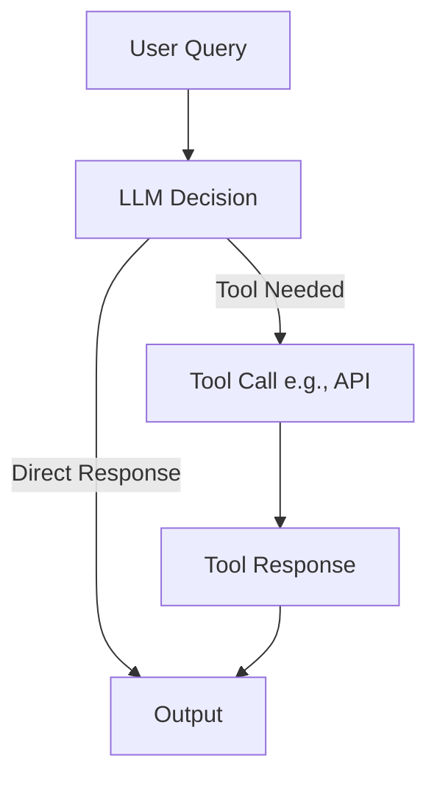
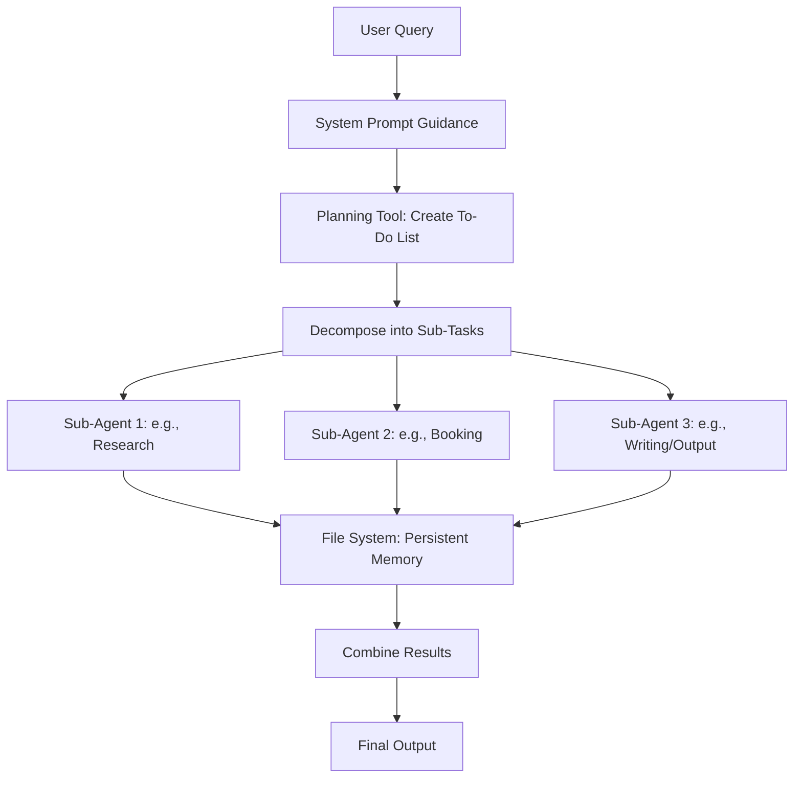

## Introduction

In the rapidly evolving field of Large Language Model (LLM) development, AI agents are becoming essential for handling tasks ranging from simple queries to complex, multi-step processes. Agents can be broadly categorized into **shallow agents** and **deep agents**. Shallow agents are basic systems designed for straightforward interactions, while deep agents incorporate advanced planning and collaboration mechanisms to tackle more intricate problems. This article explores their definitions, differences, examples, and architectures, drawing from insights in AI agent design.

## What Are Shallow Agents?

Shallow agents represent the foundational level of AI agent design. They operate through a simple, linear process where the LLM evaluates a query and decides whether to respond directly or invoke a tool (such as an API) to gather additional information.

### Key Characteristics

- **Simple Loop Mechanism**: The agent follows a basic cycle: receive input, decide on action (output or tool call), execute if needed, and respond.
- **Limited Complexity**: No explicit planning or task decomposition; suitable for one-off tasks.
- **Context Retention**: Relies on the LLM's inherent memory, which can be short-lived and insufficient for extended interactions.

### Example

A shallow agent might handle a query like "What's the weather in Paris?" by calling a weather API tool and then generating a response based on the data retrieved.

### Shallow Agent Architecture

## What Are Deep Agents?

Deep agents build on shallow designs to manage complex, long-horizon tasks. They introduce structured planning, sub-agent collaboration, and persistent memory, enabling decomposition of queries into manageable sub-tasks.

### Key Characteristics

- **Planning Tool**: Generates a to-do list or step-by-step plan for the task.
- **Sub-Agents**: Specialized agents handle individual sub-tasks, often in parallel.
- **System Prompt**: Guides overall behavior and ensures consistency.
- **Persistent Memory**: Uses a file system to store and share state across agents and iterations.

### Example

For a task like "Plan a 4-day holiday to Paris on a $1000 budget," a deep agent would create a plan (e.g., research flights, book hotel, suggest itinerary), assign sub-agents to each step, and use shared memory to track progress.

### Deep Agent Architecture

## Key Differences Between Shallow and Deep Agents

| Aspect | Shallow Agents | Deep Agents |
|--------|----------------|-------------|
| **Complexity** | Simple, linear tasks | Complex, multi-step tasks |
| **Planning** | None or minimal | Explicit decomposition and to-do lists |
| **Collaboration** | Single agent | Multiple sub-agents working in parallel |
| **Memory** | LLM-dependent, short-term | Persistent via file system |
| **Use Cases** | Quick queries (e.g., API lookups) | Deep research, coding, planning (e.g., holidays, blogs) |
| **Limitations** | Fails on long-horizon tasks | More resource-intensive but scalable |

## Examples in Practice

### Shallow Agent Examples

ReAct agents that loop through reasoning and tool actions for tasks like Wikipedia searches but without deep planning.

### Deep Agent Examples

- **Claude Code** for software engineering, where agents plan coding tasks, execute via sub-agents, and maintain state.
- **ChatGPT Deep Research Agent** for in-depth topic exploration with multiple research phases.

## When to Use Each Approach

Choose **shallow agents** when you need:
- Quick, single-step responses
- Simple API integrations
- Low-latency requirements
- Minimal resource consumption

Choose **deep agents** when you need:
- Multi-step task completion
- Complex planning and coordination
- Persistent state management
- Collaborative workflows

## Conclusion

Understanding the distinction between shallow and deep agents is crucial for building effective LLM-powered applications. While shallow agents excel at simple, direct tasks, deep agents unlock the potential for sophisticated, multi-step workflows. The choice between them depends on your specific use case, complexity requirements, and available resources. As LLM technology continues to evolve, we can expect even more advanced agent architectures that blur the lines between these categories.

---

*This post explores fundamental concepts in AI agent design. For more information on implementing these architectures, check out the official documentation of popular LLM frameworks.*
