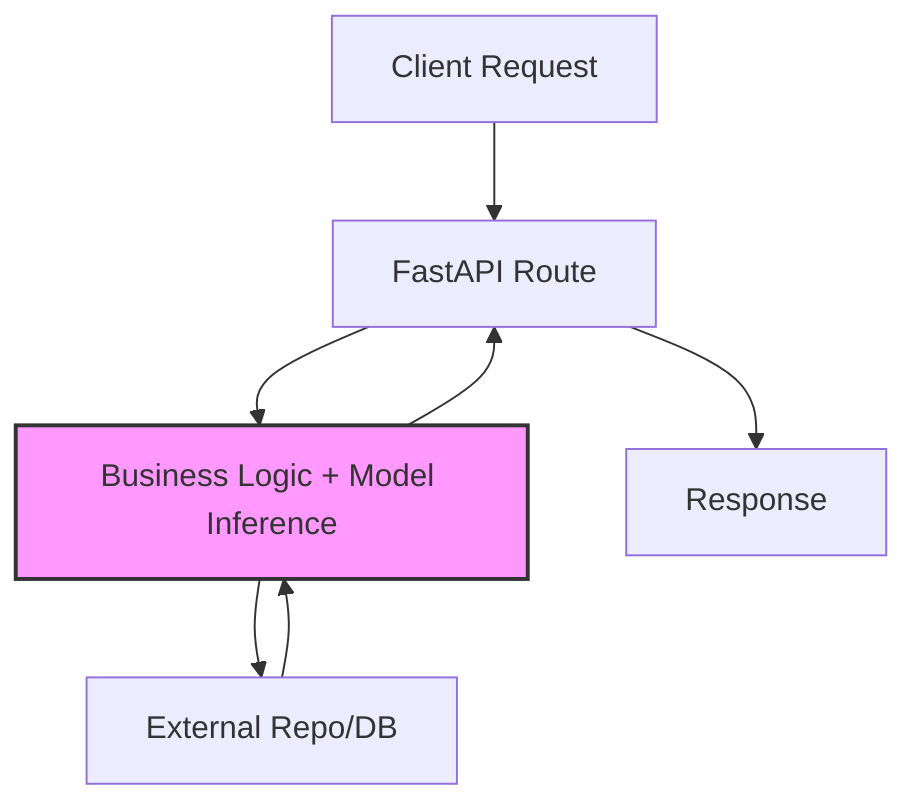

Generative AI (GenAI) microservices are at the heart of modern AI applications, powering everything from real-time chat interfaces to automated content generation. Built with FastAPI, these services must handle complex tasks like model inference, prompt validation, and integration with external APIs—all while maintaining high performance and reliability.

However, as GenAI apps grow in complexity, spaghetti code in routes can lead to maintenance nightmares. Enter the **Service Layer Pattern**: a proven architectural approach that separates business logic from API endpoints, making your microservices more modular, testable, and scalable.

This article dives into the Service Layer Pattern, showing how to implement it in FastAPI for GenAI workloads. We'll cover its benefits, a full code example, and tips for production deployment.

## The Challenge: Tightly Coupled Routes in GenAI Services

In a typical GenAI FastAPI microservice:

- Routes handle HTTP requests but also embed logic for model loading, input sanitization, and error recovery.
- Changes to business rules (e.g., switching LLMs) ripple through the entire app.
- Testing becomes cumbersome—unit tests mix API concerns with AI-specific details.
- Scaling to multiple models or backends requires rewriting endpoints.

Without a structured pattern, these issues amplify in microservices, where loose coupling is key for independent deployments and fault isolation.



This flowchart highlights the bottleneck: overloaded routes (B and C merged).

## The Service Layer Pattern: A Clean Separation

The Service Layer acts as an intermediary between your API routes and lower-level concerns (e.g., repositories for model access). It encapsulates business rules, orchestrates dependencies, and exposes clean interfaces.

### Core Components

- **API Layer (Routes)**: Handles HTTP, validation (via Pydantic), and dependency injection.
- **Service Layer**: Core business logic, like prompt processing or generation orchestration.
- **Repository Layer**: Abstracts data/model access (e.g., Hugging Face models or vector stores).

This aligns with SOLID principles, especially Dependency Inversion, allowing you to mock layers for testing.

### Mermaid Diagram: Layered Architecture

```mermaid
graph LR
    A[API Layer<br/>FastAPI Routes] --> B[Service Layer<br/>GenerationService]
    B --> C[Repository Layer<br/>ModelRepository]
    C --> D[LLM Model<br/>(e.g., GPT-2)]
    E[External APIs<br/>(e.g., OpenAI)] -.-> B
    style A fill:#e1f5fe
    style B fill:#f3e5f5
    style C fill:#e8f5e8
```

## Implementation: A GenAI Text Generation Microservice

Let's build a complete example for a text generation endpoint using a preloaded LLM. We'll preload the model (tying back to Docker caching strategies) and use the Service Layer for logic.

### Step 1: Define Models (Pydantic)

```python
# models.py
from pydantic import BaseModel

class GenerationRequest(BaseModel):
    prompt: str
    max_length: int = 50

class GenerationResponse(BaseModel):
    generated_text: str
    tokens_used: int  # Optional metadata
```

### Step 2: Repository for Model Access

```python
# repository.py
from abc import ABC, abstractmethod
from transformers import AutoModelForCausalLM, AutoTokenizer
import torch

class ModelRepository(ABC):
    @abstractmethod
    async def generate(self, prompt: str, max_length: int) -> tuple[str, int]:
        """Generate text and return decoded output with token count."""
        pass

class HuggingFaceRepository(ModelRepository):
    def __init__(self, model_name: str = "gpt2"):
        self.tokenizer = AutoTokenizer.from_pretrained(model_name)
        if self.tokenizer.pad_token is None:
            self.tokenizer.pad_token = self.tokenizer.eos_token
        self.model = AutoModelForCausalLM.from_pretrained(model_name)
        # Move to GPU if available
        self.device = torch.device("cuda" if torch.cuda.is_available() else "cpu")
        self.model.to(self.device)

    async def generate(self, prompt: str, max_length: int) -> tuple[str, int]:
        inputs = self.tokenizer(prompt, return_tensors="pt", padding=True).to(self.device)
        with torch.no_grad():
            outputs = self.model.generate(
                **inputs, max_length=max_length, do_sample=True, temperature=0.7
            )
        generated = self.tokenizer.decode(outputs[0], skip_special_tokens=True)
        tokens_used = len(outputs[0]) - len(inputs["input_ids"][0])
        return generated, tokens_used
```

### Step 3: Service Layer for Business Logic

```python
# service.py
from typing import Optional
from .models import GenerationRequest, GenerationResponse
from .repository import ModelRepository

class GenerationService:
    def __init__(self, repo: ModelRepository):
        self.repo = repo

    async def generate_text(self, request: GenerationRequest) -> Optional[GenerationResponse]:
        # Business rules: Sanitize and validate
        prompt = request.prompt.strip()
        if not prompt or len(prompt) > 1000:  # Rate-limit long prompts
            raise ValueError("Invalid prompt: Must be 1-1000 characters")
        
        # Orchestrate generation
        generated, tokens = await self.repo.generate(prompt, request.max_length)
        
        # Post-process (e.g., truncate or format)
        generated = generated[len(prompt):].strip()  # Remove echoed prompt
        
        return GenerationResponse(
            generated_text=generated,
            tokens_used=tokens
        )
```

### Step 4: FastAPI App with Dependency Injection

```python
# main.py
from fastapi import FastAPI, Depends, HTTPException
from contextlib import asynccontextmanager
from .models import GenerationRequest, GenerationResponse
from .service import GenerationService
from .repository import HuggingFaceRepository

# Global instances (preloaded at startup)
model_repo: HuggingFaceRepository
generation_service: GenerationService

@asynccontextmanager
async def lifespan(app: FastAPI):
    global model_repo, generation_service
    # Startup: Preload model
    model_repo = HuggingFaceRepository("gpt2")
    generation_service = GenerationService(model_repo)
    print("✅ Model and service initialized.")
    yield
    # Shutdown: Cleanup
    print("🔄 Cleaning up resources.")

app = FastAPI(lifespan=lifespan)

@app.post("/generate", response_model=GenerationResponse)
async def generate_text(
    request: GenerationRequest,
    service: GenerationService = Depends(lambda: generation_service)
):
    try:
        result = await service.generate_text(request)
        return result
    except ValueError as e:
        raise HTTPException(status_code=400, detail=str(e))
```

Run with `uvicorn main:app --reload` and test via `/docs`.

## Benefits of the Service Layer in GenAI Microservices

| Benefit | Impact on GenAI |
|---------|-----------------|
| **Modularity** | Swap repositories (e.g., local to cloud LLM) without touching routes. |
| **Testability** | Mock services in pytest for fast, isolated tests—no model loading needed. |
| **Scalability** | Services handle async orchestration for high-throughput inference. |
| **Maintainability** | Centralized logic reduces bugs in prompt handling or error recovery. |

In 2025's GenAI landscape, this pattern shines for multi-model services, enabling seamless A/B testing or hybrid local/cloud setups.

## Extra Tips for Production

- **Dependency Injection with Containers**: Use `dependency-injector` for advanced wiring in larger apps.
- **Caching in Services**: Integrate Redis for repeated prompt results to cut inference costs.
- **Monitoring**: Add logging in services (e.g., via `structlog`) to track token usage and latencies.
- **Security**: Validate prompts against injection in the service layer using libraries like `promptguard`.
- **Docker Integration**: Preload in startup events, as before, for zero-cold-start deploys.

## Key Takeaways

| Component | Role |
|-----------|------|
| Repository | Abstracts model/DB access |
| Service | Encapsulates business rules |
| API Layer | Handles HTTP and injection |
| Lifespan Events | Ensures preloading at startup |

The Service Layer Pattern transforms chaotic GenAI FastAPI services into robust, enterprise-grade microservices. It's a small refactor with massive returns in flexibility and reliability.

## Final Thoughts

As GenAI evolves, architectural patterns like this will be crucial for sustainable development. Whether you're building the next AI agent or a simple inference API, start layering your logic today—your future self (and team) will thank you. 🚀
