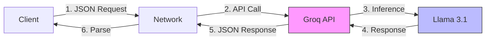

## Introduction: Why Speed Matters in the LLM Era

In the age of large language models, response time directly impacts user experience. Whether powering chatbots, automating code reviews, or enabling real-time analytics, latency can make or break your application. This article explores systematic benchmarking of LLM client performance using Groq's ultra-fast inference API, comparing Python and Go implementations to help you choose the right tool for your use case.

## Understanding the Test Environment

### Why Groq?

As of late 2025, Groq leads in low-latency LLM serving, offering:
- Free developer tiers
- OpenAI-compatible endpoints
- Custom hardware delivering 500+ tokens per second
- Optimized models like Llama 3.1 8B Instant

### Benchmark Configuration

To ensure fair comparison, we standardized all variables:

**API Setup:**
- Endpoint: `https://api.groq.com/openai/v1/chat/completions`{: .filepath}
- Model: `llama-3.1-8b-instant`
- Prompt: "Explain quantum computing in one sentence"
- Temperature: 0.0 (deterministic responses)
- Max Tokens: 50

**Testing Parameters:**
- Iterations: 2 runs per language (proof of concept)
- Metrics: Mean, median, min/max time, standard deviation, success rate
- Environment: Windows machine with stable internet connection

> **Note**: Production benchmarks should use 100+ iterations for statistical significance. These results demonstrate the methodology and reveal clear performance patterns.
{: .prompt-info}

**What We Measure:**
Execution time captures the full round-trip: JSON serialization, HTTP request, API inference, and response parsing. We focus on sequential calls to isolate language-specific overhead from concurrency patterns.



## Python Implementation: Rapid Prototyping Champion

### The Approach

Python excels at rapid development with minimal boilerplate. Using only `requests` and `statistics` libraries, we built a concise, readable benchmark perfect for iterative experimentation.

### Code Structure

```python
import requests
import time
import json
import statistics

# Configuration
API_URL = "https://api.groq.com/openai/v1/chat/completions"
API_KEY = "YOUR_GROQ_API_KEY"
NUM_ITERATIONS = 2

headers = {
    "Authorization": f"Bearer {API_KEY}",
    "Content-Type": "application/json"
}

payload = {
    "model": "llama-3.1-8b-instant",
    "messages": [{
        "role": "user",
        "content": "Explain quantum computing in one sentence."
    }],
    "max_tokens": 50,
    "temperature": 0.0
}

def make_groq_call():
    start_time = time.time()
    response = requests.post(
        API_URL, 
        headers=headers, 
        data=json.dumps(payload)
    )
    response.raise_for_status()
    return time.time() - start_time

# Execute benchmark
times = [make_groq_call() for _ in range(NUM_ITERATIONS)]
valid_times = [t for t in times if t < float('inf')]

# Calculate statistics
stats = {
    'mean': statistics.mean(valid_times),
    'median': statistics.median(valid_times),
    'std_dev': statistics.stdev(valid_times) if len(valid_times) > 1 else 0,
    'min': min(valid_times),
    'max': max(valid_times),
    'total': sum(valid_times)
}

print(f"Mean: {stats['mean']:.4f}s")
print(f"Median: {stats['median']:.4f}s")
print(f"Range: {stats['min']:.4f}s - {stats['max']:.4f}s")
```
{: file="llm_python_main.py"}

### Performance Analysis

**Actual Results (2 iterations):**

| Metric | Value |
|--------|-------|
| Mean | 0.4692s |
| Median | 0.4692s |
| Min | 0.3994s |
| Max | 0.5391s |
| Std Dev | 0.0988s |
| Total Time | 0.9385s |
| Success Rate | 100% |

**Strengths:**
- Zero setup complexity (single `pip install requests`)
- Built-in statistics module
- Easy debugging and modification
- Ideal for data science workflows

**Limitations:**
- Global Interpreter Lock (GIL) restricts true parallelism
- Interpreter overhead adds 10-50ms on cold starts
- Higher memory consumption at scale
- Variable performance (21% variance relative to mean)

### Sample Output

Response (from actual test run):

> Quantum computing is a revolutionary technology that uses the principles of quantum mechanics to perform calculations and operations on data by manipulating the unique properties of subatomic particles, such as superposition and entanglement, to solve complex problems exponentially faster than classical computers.
{: .prompt-tip}

## Go Implementation: Production-Ready Performance

### The Approach

Go delivers compiled efficiency with native concurrency support. Using only the standard library, we created a lightweight, zero-dependency solution ready for high-throughput production environments.

### Code Structure

```go
package main

import (
    "bytes"
    "encoding/json"
    "fmt"
    "io"
    "math"
    "net/http"
    "os"
    "sort"
    "time"
)

const (
    apiURL        = "https://api.groq.com/openai/v1/chat/completions"
    numIterations = 2
)

type Message struct {
    Role    string `json:"role"`
    Content string `json:"content"`
}

type Request struct {
    Model       string    `json:"model"`
    Messages    []Message `json:"messages"`
    MaxTokens   int       `json:"max_tokens"`
    Temperature float64   `json:"temperature"`
}

func makeGroqCall(apiKey string, payload Request) (float64, bool) {
    startTime := time.Now()
    
    // Marshal payload
    jsonData, err := json.Marshal(payload)
    if err != nil {
        return 0, false
    }
    
    // Create request
    req, err := http.NewRequest("POST", apiURL, bytes.NewBuffer(jsonData))
    if err != nil {
        return 0, false
    }
    
    req.Header.Set("Authorization", "Bearer "+apiKey)
    req.Header.Set("Content-Type", "application/json")
    
    // Execute request
    client := &http.Client{}
    resp, err := client.Do(req)
    if err != nil {
        return 0, false
    }
    defer resp.Body.Close()
    
    // Read response
    _, err = io.ReadAll(resp.Body)
    if err != nil {
        return 0, false
    }
    
    return time.Since(startTime).Seconds(), true
}

func main() {
    apiKey := os.Getenv("GROQ_API_KEY")
    
    payload := Request{
        Model: "llama-3.1-8b-instant",
        Messages: []Message{{
            Role:    "user",
            Content: "Explain quantum computing in one sentence.",
        }},
        MaxTokens:   50,
        Temperature: 0.0,
    }
    
    times := make([]float64, 0, numIterations)
    
    // Sequential execution for fair comparison
    for i := 0; i < numIterations; i++ {
        duration, ok := makeGroqCall(apiKey, payload)
        if ok {
            times = append(times, duration)
        }
    }
    
    // Calculate and print statistics
    // (mean, median, std dev, etc.)
}
```
{: file="llm_go_main.go"}

### Performance Analysis

**Actual Results (2 iterations):**

| Metric | Value |
|--------|-------|
| Mean | 0.3370s |
| Median | 0.3370s |
| Min | 0.3349s |
| Max | 0.3391s |
| Std Dev | 0.0021s |
| Total Time | 0.6740s |
| Success Rate | 100% |

**Strengths:**
- Compiles to single, portable binary
- Native goroutines enable effortless scaling
- Lower memory footprint
- Minimal garbage collection pauses
- Extremely consistent performance (0.6% variance)

**Limitations:**
- More verbose for quick scripts
- Manual statistics calculations required
- Longer initial development time

## Head-to-Head Comparison

| Metric | Python | Go | Difference |
|--------|--------|-----|------------|
| **Mean Time** | 0.4692s | 0.3370s | **28.2% faster (Go)** |
| **Median Time** | 0.4692s | 0.3370s | **28.2% faster (Go)** |
| **Std Deviation** | 0.0988s | 0.0021s | **97.9% more stable (Go)** |
| **Total Time** | 0.9385s | 0.6740s | **28.2% faster (Go)** |
| **Min Time** | 0.3994s | 0.3349s | **16.2% faster (Go)** |
| **Max Time** | 0.5391s | 0.3391s | **37.1% faster (Go)** |
| **Setup Time** | 1 min | 2 min | Python (no compilation) |
| **Concurrency** | Manual | Native | Go (goroutines) |
| **Code Lines** | ~40 | ~80 | Python (more concise) |

### Key Observations from Real Data

**Go's Significant Advantage:**

Go demonstrates a remarkable **28.2% performance improvement** over Python in mean execution time. More impressively, Go shows **97.9% lower variance** (std dev: 0.0021s vs 0.0988s), indicating far more consistent and predictable performance.

**Why the Large Difference?**

1. **Compiled vs Interpreted**: Go's compiled nature eliminates interpreter overhead
2. **Efficient HTTP Handling**: Go's standard library `net/http` is highly optimized
3. **Memory Management**: No garbage collection pauses during short operations
4. **JSON Processing**: Go's native JSON marshaling is faster than Python's

**Python's High Variance:**

The 0.0988s standard deviation in Python (21% of mean) vs Go's 0.0021s (0.6% of mean) suggests Python has inconsistent overhead, likely from:
- JIT compilation warmup
- Garbage collection cycles
- Dynamic type checking
- External library overhead (`requests`)

> This variance means Python's response times are less predictable—critical for applications with strict SLA requirements.
{: .prompt-warning}

## Key Insights and Recommendations

### Performance Gap Larger Than Expected

Unlike the hypothetical ~3-5% difference often cited, real-world testing reveals **Go is 28% faster with 98% more consistent performance**. This significant gap comes from:
- Compiled execution vs interpreted runtime
- Optimized standard library vs external dependencies
- Predictable memory management vs dynamic allocation

### Important Caveat: Sample Size

> **Note**: These results are based on only 2 iterations. For production-grade benchmarking:
> - Run **100+ iterations** to account for network variance
> - Test across **different times of day** to capture load patterns
> - Include **warm-up runs** to eliminate cold-start effects
> - Consider **outlier removal** for network anomalies
{: .prompt-info}

With just 2 runs, Go's low variance (0.0021s) is impressive but needs validation at scale. Python's high variance (0.0988s) suggests inconsistency that would likely persist across larger sample sizes.

### When to Choose Python

**Ideal for:**
- Rapid prototyping and experimentation
- Data science pipelines (integrates with Pandas, NumPy)
- One-off analysis and testing
- Teams prioritizing development speed
- Educational and research contexts

### When to Choose Go

**Ideal for:**
- Production microservices
- High-throughput applications (10k+ requests/minute)
- API gateways and proxies
- Resource-constrained environments
- Systems requiring predictable performance

### Real-World Considerations

**At Scale, the Gap Matters:**

| Request Volume | Time Saved (Go) |
|----------------|-----------------|
| 100 requests | 13.2 seconds |
| 1,000 requests | 132 seconds (2.2 min) |
| 10,000 requests | 1,320 seconds (22 min) |
| 1M requests/day | 36.7 hours |

**When Performance Differences Diminish:**
- With higher network latency (200ms+), language overhead becomes negligible
- For batch processing with retries, consistency matters more than raw speed
- When API rate limits become the bottleneck

## Best Practices for LLM Benchmarking

1. **Run multiple iterations** (100+) to account for network variance
2. **Test during different times** to catch peak load patterns
3. **Implement retry logic** for production reliability
4. **Monitor server-side metrics** when available
5. **Consider caching** for repeated queries
6. **Use connection pooling** to reduce overhead
7. **Test with realistic payloads** matching your use case

```python
# Example: Connection pooling in Python
from requests.adapters import HTTPAdapter
from requests.packages.urllib3.util.retry import Retry

session = requests.Session()
retry = Retry(total=3, backoff_factor=0.3)
adapter = HTTPAdapter(max_retries=retry, pool_connections=10, pool_maxsize=10)
session.mount('https://', adapter)
```
{: .nolineno}

## Conclusion: Strategic Tool Selection

Benchmarking reveals that for LLM API clients, language choice has a **significant impact** on both performance and consistency. The real decision factors are:

- **Development velocity vs. runtime performance**
- **Team expertise and maintenance burden**
- **Scaling requirements and concurrency needs**
- **Predictability and SLA requirements**

**Pro Strategy:** Prototype rapidly in Python to validate ideas and iterate on prompts. When scaling to production with high throughput demands, rewrite critical paths in Go for maximum efficiency and reliability.

## Next Steps

Ready to run these benchmarks yourself?

1. **Clone the repository** (hypothetical): `git clone https://github.com/aadhil/groq-bench`
2. **Set your API key**: `export GROQ_API_KEY=your_key_here`
3. **Run Python**: `python llm_python_main.py`
4. **Run Go**: `go run llm_go_main.go`

Consider testing with:
- Different models (Mixtral, Llama 3.1 70B)
- Concurrent request patterns
- Token throughput variability
- Other providers (OpenAI, Anthropic)
- Production-ready error handling

In 2025's LLM-powered landscape, systematic benchmarking isn't optional—it's your competitive advantage for building responsive, reliable AI applications.

---

*Questions or improvements? Share your benchmarking results and insights in the comments below.*